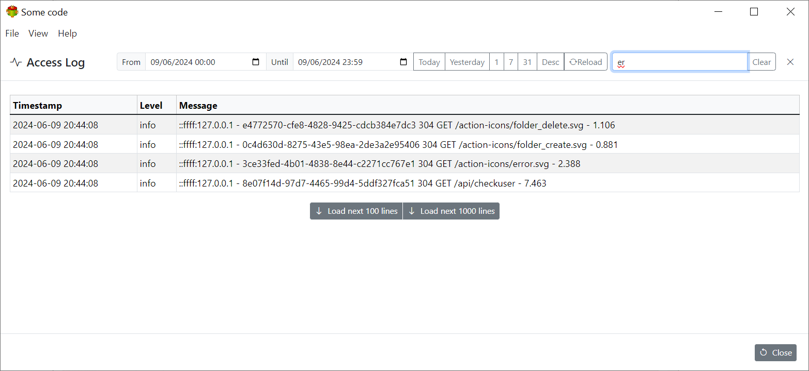

Access log provides a convenient way of investigating the issues




## Log files location

**Windows**

```cmd
C:\ProgramData\some-code.com\some-code\log
```

**Linux**

```bash
/var/log/some-code.com/some-code/
```

> Over time the logs will grow in size so it is important to delete them periodically
