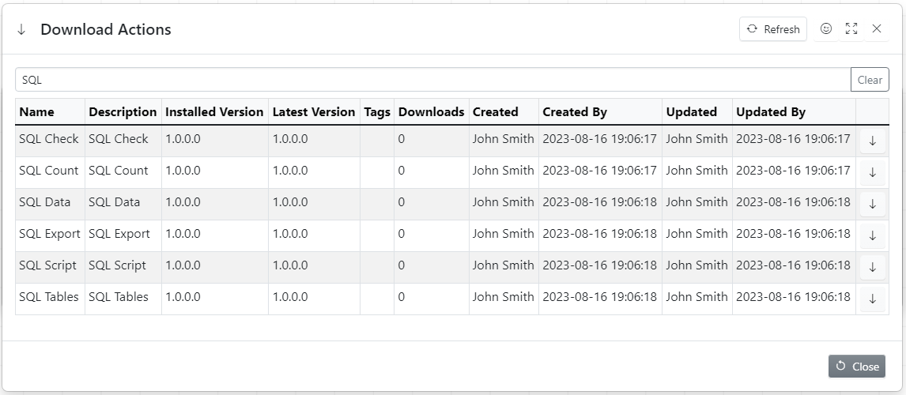
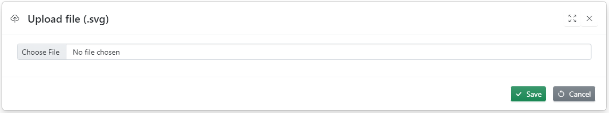
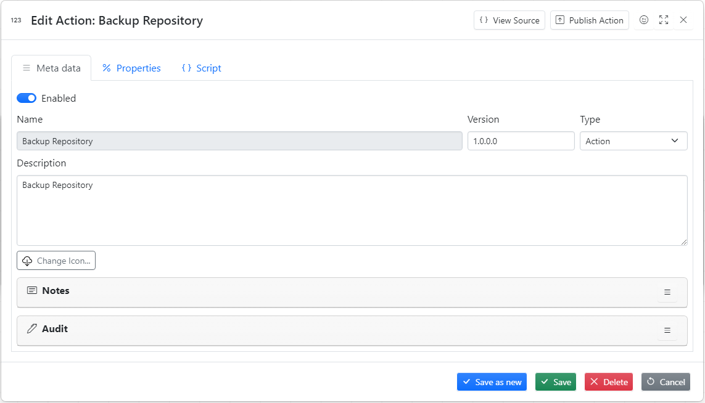
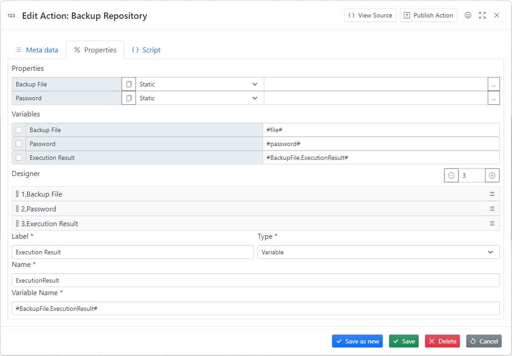
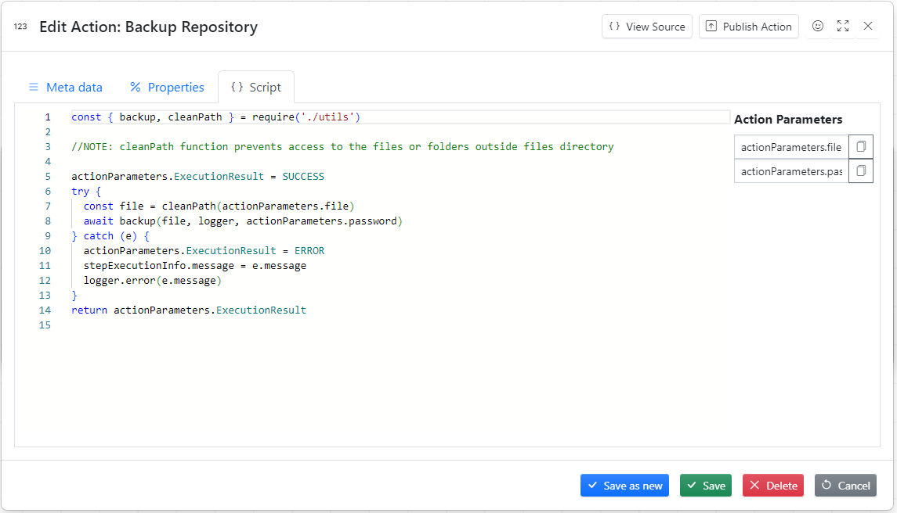
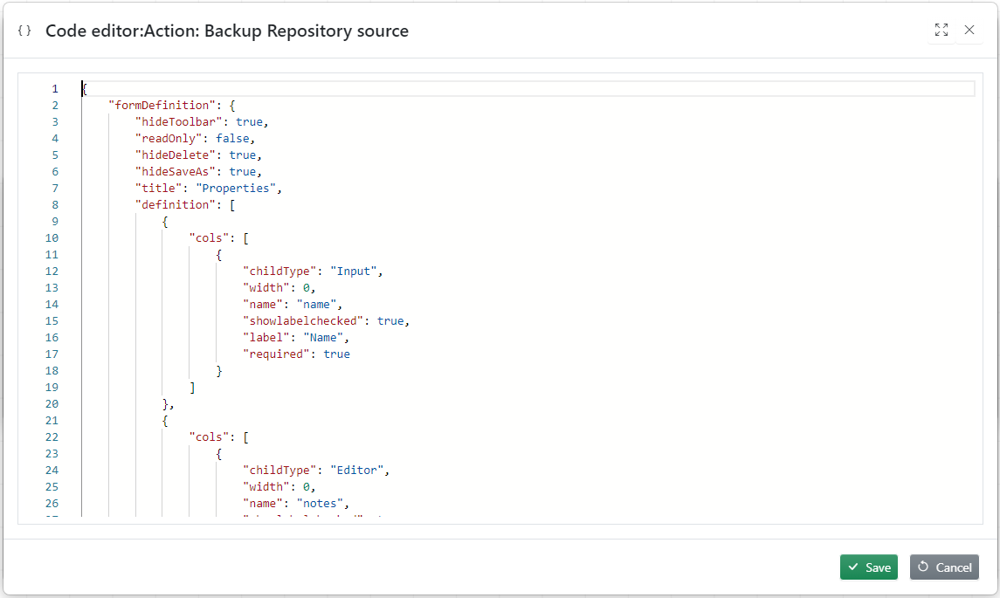

One of major benefits of working with **"Some Code"** is how easy it is to create custom actions.

Everything is user definable:

1. Action Icon is user definable
1. The design of Metadata tab is user definable
1. Parameters list is user definable
1. Parameter type is user definable
1. Variables list is user definable
1. Action script is user definable

## Action Library

All currently installed actions are stored in Action library. This dialog allows to create new actions or download actions the from public library


### Download Actions



## Creating New Action

To create new action click **Add Action**, fill in all necessary fields and press **Save** button

### Action icons

- We used [bootstrap icons](https://icons.getbootstrap.com/) for most our actions and we recommend our users to do the same
- If necessary they can be easily modified using [InkScape](https://inkscape.org/)



### Metadata Tab



Metadata Tab defines action look and feel

### Properties Tab



- To add new property click plus
- Properties can be rearranged using drag and drop
- Always use password type for password parameters
- Always add ExecutionResult Variable
- It is extremely important to select correct property type

**Property types**


### Script Tab



**Script Example**

```javascript
const { backup, cleanPath } = require("./utils");

//NOTE: cleanPath function prevents access to the files or folders outside files directory

actionParameters.ExecutionResult = SUCCESS;
try {
  const file = cleanPath(actionParameters.file);
  await backup(file, logger, actionParameters.password);
} catch (e) {
  actionParameters.ExecutionResult = ERROR;
  stepExecutionInfo.message = e.message;
  logger.error(e.message);
}
return actionParameters.ExecutionResult;
```

## Action code editor

Action definition is stored in JSON format. Code editor allows advanced users to edit Action definition manually.



## Publish Action

This dialogue publishes action to the public library so it can be used by all users of **Some code**


