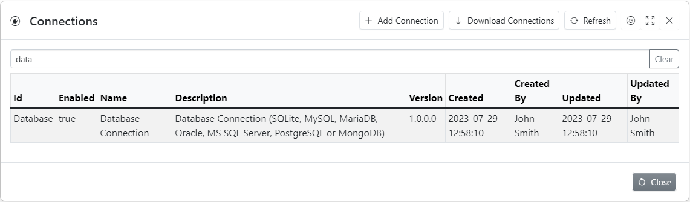
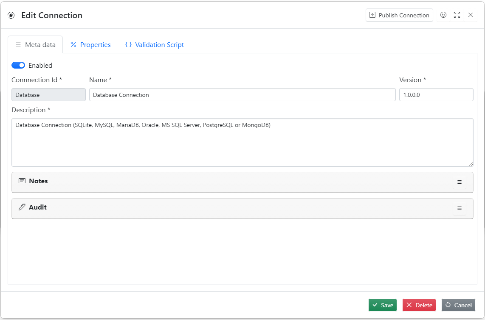
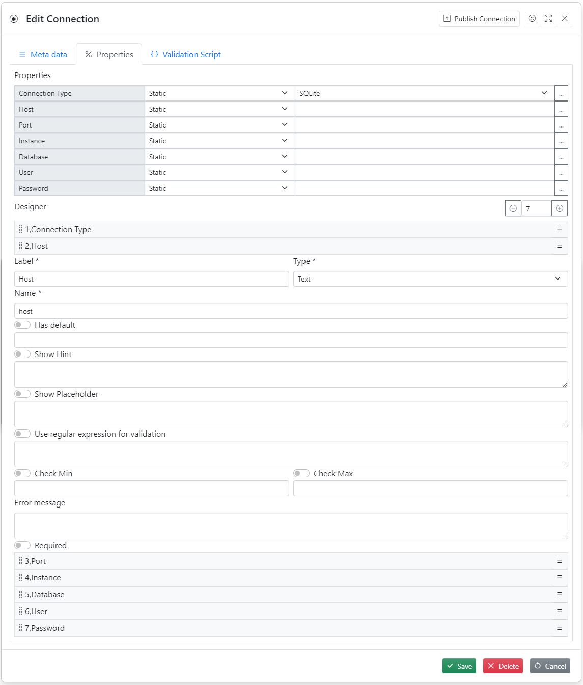
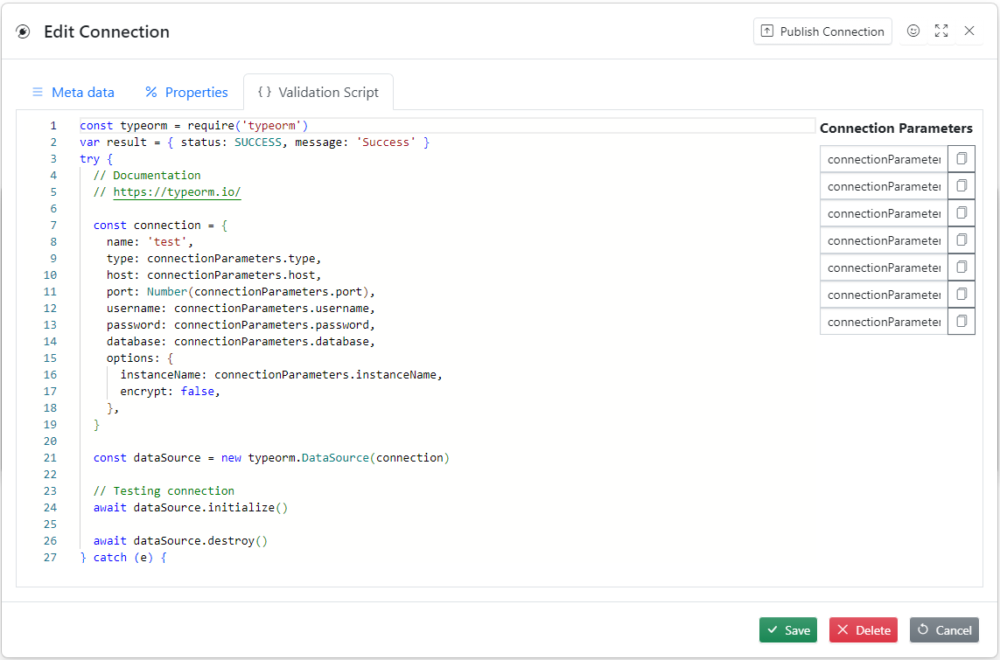

The Connection defines list values the credential must have

For example

**Database connection**

1. host name
1. port
1. database name
1. user name
1. password

**Database credential**

1. host name = some-code
1. port = 1534
1. database name = sales
1. user name = john
1. password = fjwlfmw1

List of connection properties is user definable

## Connections List



This dialog allows to create new credentials or download credentials the from public library

### Download Connection


## Creating New Connection

To create new connection click **Add Connection**, fill in all necessary fields and press **Save** button

### Metadata Tab



## Properties Tab



- To add new property click plus
- Properties can be rearranged using drag and drop
- Always use password type for password parameters
- It is extremely important to select correct property type

**Property types**


## Validation Script Tab



**Validation Script Example**

```javascript
const typeorm = require('typeorm')
var result = { status: SUCCESS, message: 'Success' }
try {
  // Documentation
  // https://typeorm.io/

  const connection = {
    name: 'test',
    type: connectionParameters.type,
    host: connectionParameters.host,
    port: Number(connectionParameters.port),
    username: connectionParameters.username,
    password: connectionParameters.password,
    database: connectionParameters.database,
    options: {
      instanceName: connectionParameters.instanceName,
      encrypt: false,
    },
  }

  const dataSource = new typeorm.DataSource(connection)

  // Testing connection
  await dataSource.initialize()

  await dataSource.destroy()
} catch (e) {
  result.status = ERROR
  result.message = e.message
}

return result
```

## Publish Connection

This dialogue publishes connection to the public library so it can be used by all users of **Some code**


