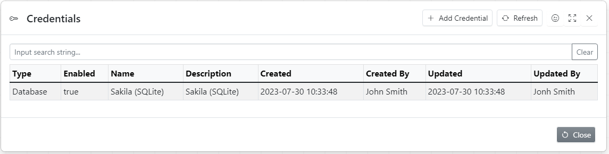
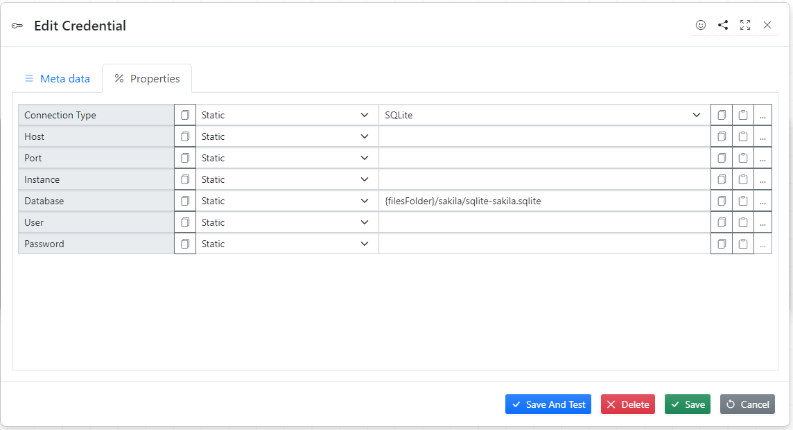
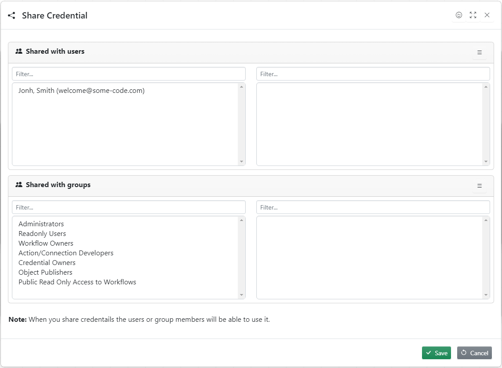

Credential holds list of values defined by connection

**Database credential**

1. host name = some-code
1. port = 1534
1. database name = sales
1. user name = john
1. password = fjwlfmw1

## Credentials List

This dialog allows to create and test credentials

## Creating New Credential

To create new credential click **Add Credential**, fill in all necessary fields and press **Save** button

### Metadata Tab

### Properties Tab

### Share Credential

This dialogue allows the user to share credential with other users or group

