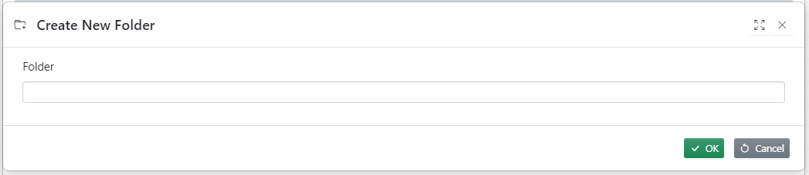
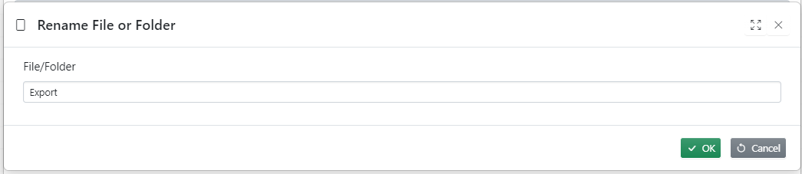
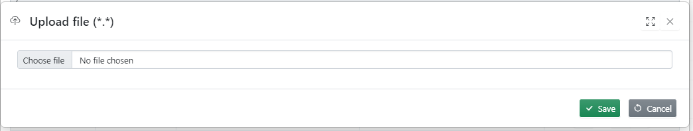

File browser provides a convenient of working with file system. It can accessed from vertical tools bar or from action property when property type is File or Folders.

**Note:** Creating folders, uploading, deleting files/folders can be only done by the admins

## File browser dialogue

## Create Folder

## Rename file/Folder

## Upload file

