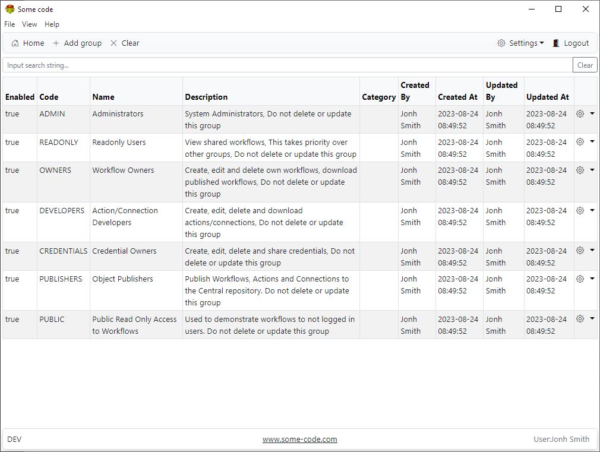
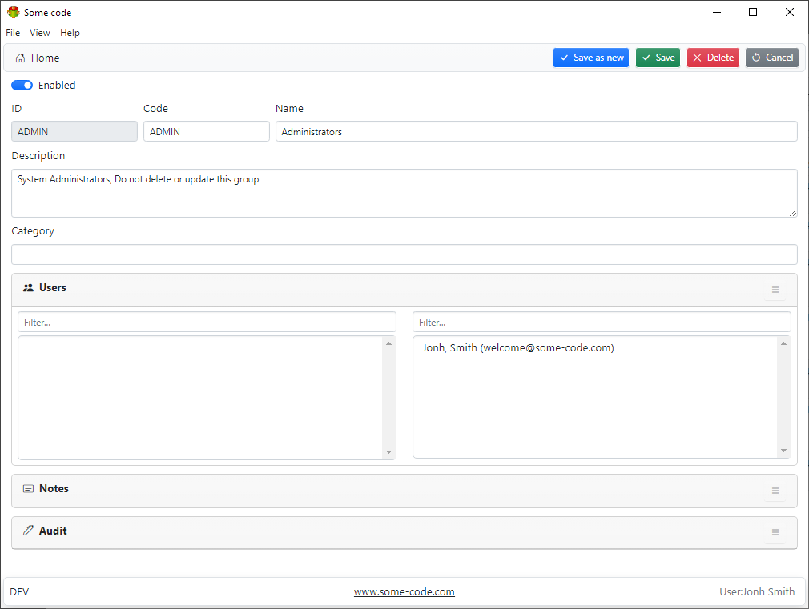

## Groups List

## Group form

**Note**

It is possible to delete all groups or disable them by accident. In this case, it might not be possible to login into Some code

Follow these steps to recover

- Set ENABLE_SECURITY=0
- Restart Some code
- Recreate/Enable groups
- Set ENABLE_SECURITY=1
- Restart Some code

## Groups

### ADMIN Administrators

- Can see and do everything

### READONLY Read only users

- Can see workflows and logs shared with them
- No access to the rest
- READONLY takes priority over everything

### USERS Workflow Creators'

- Can create/edit their own workflows
- Can see their own logs
- Can see/use shared with them connections

### ACTION Action Creators

- Can create/edit actions
- Can download Workflows, Actions and Connection definitions

### CONNECTIONS Connection Creators

- Can create/edit Connections

### PUBLISHERS Object Publishers

- Can publish/download Workflows, Actions and Connection definitions
