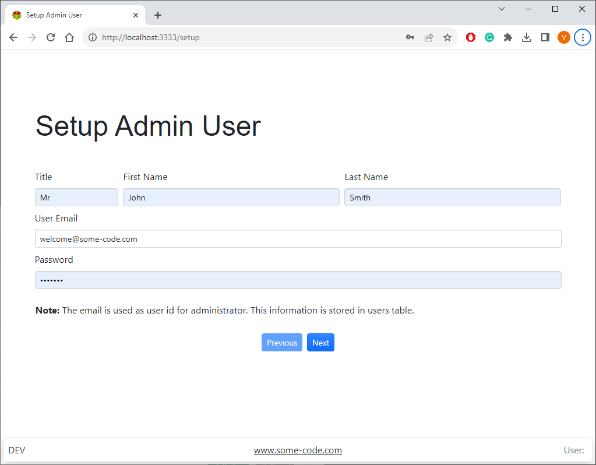

Download the software and run the following commands

```
sudo apt install ./url-logger-amd64.deb
```

(This will install the software)

```

sudo systemctl enable etl-tools-url-logger
```

(This will enable the server)

```
sudo systemctl start etl-tools-url-logger
```

(This will start the server)

```

sudo systemctl stop etl-tools-url-logger
```

(Use this command to stop the server)

## Setup

Once Some code is started open the following URL in the browser

http://localhost:3333

Follow the setup procedure

## Creating admin user



## Setting email notifications


> Email notifications are used for password recovery and user invitations

If you are unable to see the screens above try changing the port or follow trouble-shooting procedure

[Settings](settings)
