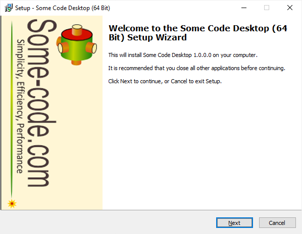
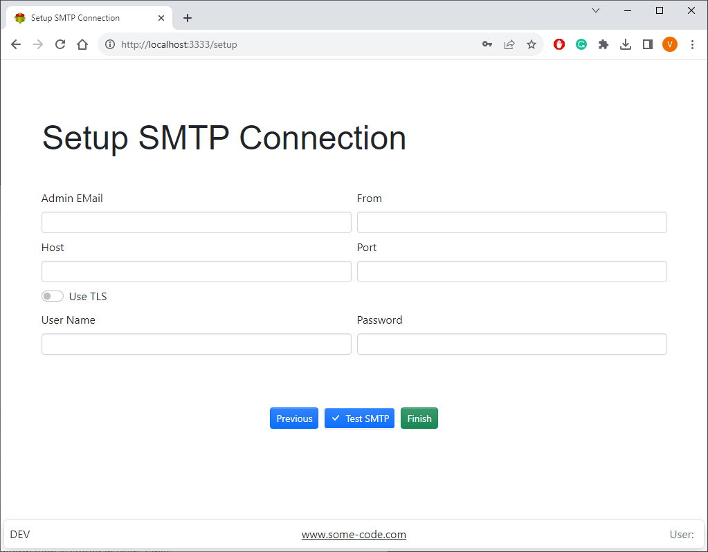

Run setup and follow the wizard steps

## Creating admin user

## Setting email notifications

> Email notifications are used for password recovery and user invitations

If you are unable to see the screens above try changing the port or follow trouble-shooting procedure

[Settings](settings)
