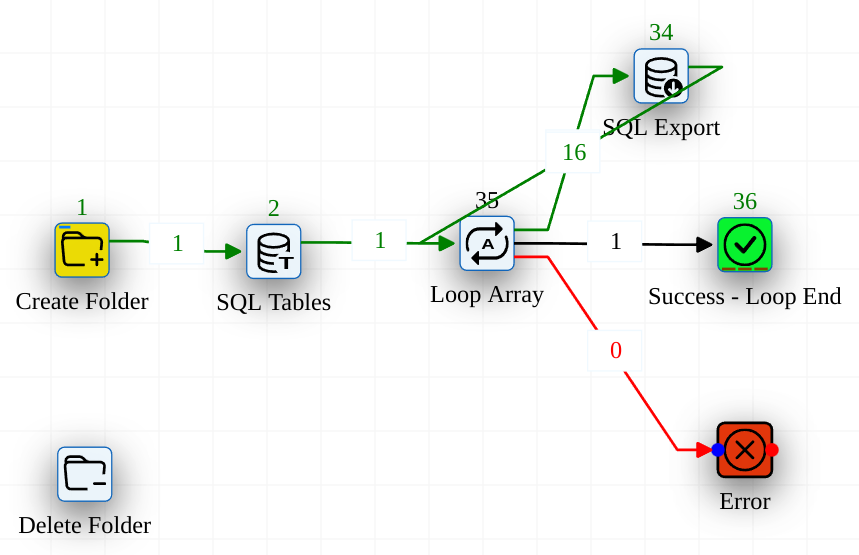
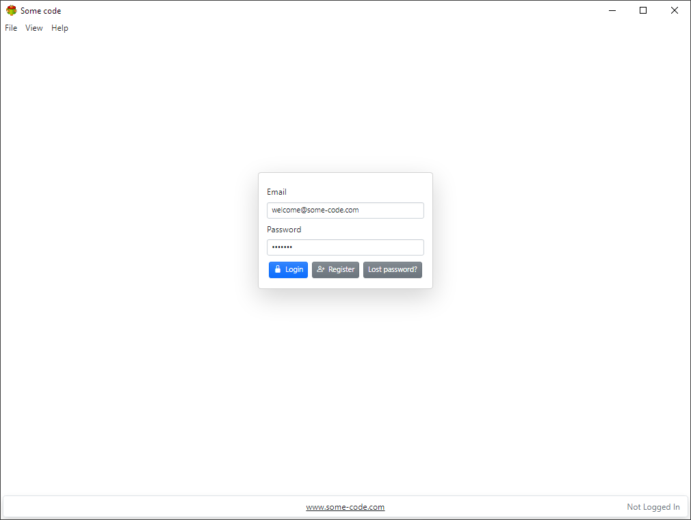
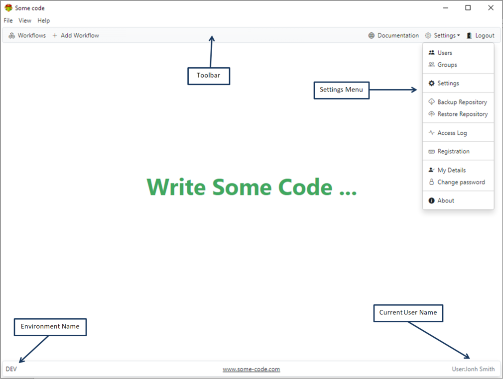
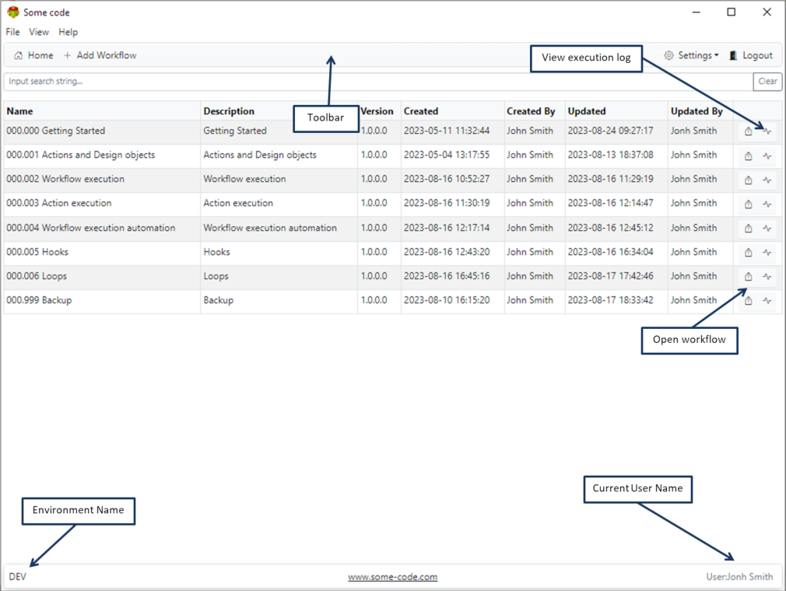

## About Some Code

Some code is a workflow management software. It helps the end uses to automates routine tasks. Some code runs on windows and linux. It can be run inside web browser and as standalone desktop application. It is **free for personal use**

### Workflow example

## Getting started

Once installation is completed the user is presented with login dialogue.

**Note:** it is possible to completely disable security using settings dialogue

### Front page

**Note:** Some settings menu items only visible to administrators

### List of available workflows

Click on the row to open the workflow

**Note:** Users can only see workflows they have access to
