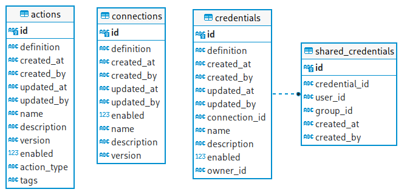
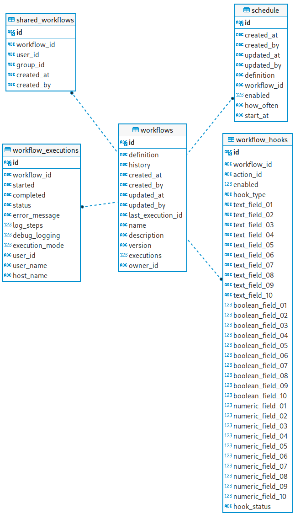
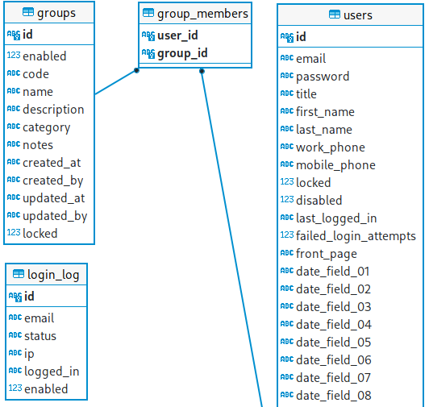

Below is a list of tables used by Some code

| Table Name          | Usage                                  |
| ------------------- | -------------------------------------- |
| actions             | Action definitions list                |
| connections         | Connection definitions list            |
| credentials         | Credentials (User names,Passwords etc) |
| shared_credentials  | Self explanatory                       |
| workflows           | Workflows definitions list             |
| workflow_executions | History of workflow execution          |
| schedule            | Workflows execution schedule           |
| workflow_hooks      | Workflow hooks parameters              |
| shared_workflows    | Self explanatory                       |
| groups              | Security groups                        |
| users               | List of some code users                |
| login_log           | User login log                         |

_Repository also holds additional tables reserved for future use_

## Repository Schema

\

\

