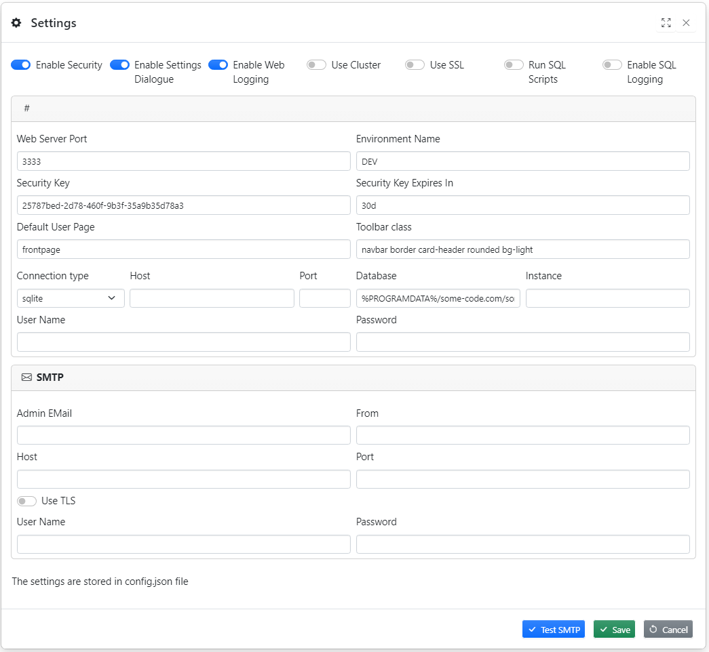

Settings-dialogue is only available for **Admin users**



## List of options

### Enable Security

When security is disabled every one has unlimited access to Some code, We do not recommend running Some code with disabled security

### Enable Settings Dialogue

Enables/ disables (hides) Preferences Screen

### Enable Web Logging

Enables logging

### Use Cluster

Improves performance with large number of users

### Use SSL

Enables HTTPS server

### Run SQL Scripts

Performs repository upgrade. Only set this option when asked by support

### Enable SQL Logging

Only set this option when asked by support

### Web Server Port

http://computer:port

### Environment Name

### Security Key

Used for password encryption

### Security Key Expires In

User session expiration time in days

### Default User Page

Do not change

### Toolbar class

Changes top toolbar look and feel

### Connection type

Repository Database Connection type

### Host

Repository Database hostname

### Port

Repository Database port

### Database

Location/Name of File System Event Logger repository database

### Instance

SQL Server instance name

### User Name

Repository Database User Name

### Password

Repository Database Password

## SMTP Settings

SMTP is used to send email notifications to admins and for password recovery

### Admin EMail

Administrator receives emails about new user registrations

### From

From email

### Host

SMTP server host

### Port

SMTP server port

### Use TLS

SMTP server TLS flag

### User Name

SMTP server user name

### Password

SMTP server user password

**Note:** The settings are stored in config.json file

## Default Config.json file

```json
{
  "RUN_SQL_SCRIPTS": 1,
  "WEB_SERVER_PORT": 3333,
  "ENVIRONMENT_NAME": "DEV",
  "ENABLE_SECURITY": 1,
  "ENABLE_PREFERENCES_SCREEN": 1,
  "JWT_KEY": "e379e697-0a16-42fe-a1f8-a8cbf84a911c",
  "JWT_EXPIRES_IN": "30d",
  "DEFAULT_USER_PAGE": "frontpage",
  "NODE_ENV": "production",
  "CONNECTION_TYPE": "sqlite",
  "DB_USER": "",
  "DB_PASS": "",
  "DB_NAME": "%PROGRAMDATA%/some-code.com/some-code/some-code.sqlite",
  "DB_HOST": "",
  "DB_PORT": "",
  "DB_INSTANCE": "",
  "ENABLE_LOGGING": 1,
  "SQL_LOGGING": 0,
  "USE_CLUSTER": 0,
  "USE_SSL": 0,
  "LIBRARY_SERVER": "https://library.some-code.com",
  "TOOLBAR_CLASS": "navbar border card-header rounded bg-light",
  "SMTP_USE_TLS": 1,
  "SMTP_HOST": "",
  "SMTP_PORT": "465",
  "SMTP_USER": "",
  "SMTP_PASS": "",
  "ADMIN_EMAIL": "",
  "SMTP_FROM": ""
}
```

## Config.json file location

- Windows: C:\ProgramData\some-code.com\some-code
- Linux: /etc/some-code.com/some-code

## Restarting Some code after changing options

### Windows

Restart some-code.com server (64bit) windows service

### Linux

Run the following commands

```bash
sudo systemctl stop some-code-server
sudo systemctl start some-code-server
```
