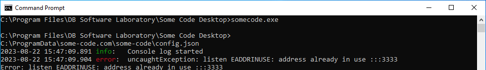

## Windows

### Server

- Stop Some code server (64bit) windows service
- Open command line prompt and run

```cmd
cd C:\Program Files\DB Software Laboratory\Some Code Server\
some_code.exe
```

### Desktop

- Close Some code desktop
- Open command line prompt and run

```cnd
cd C:\Program Files\DB Software Laboratory\Some Code Desktop\
somecode.exe
```

## Linux

```cmd
sudo systemctl stop some-code-server
cd /opt/some-code.com/some-code
sudo -u some-code ./some_code
```

Refresh the page\
Check the output


