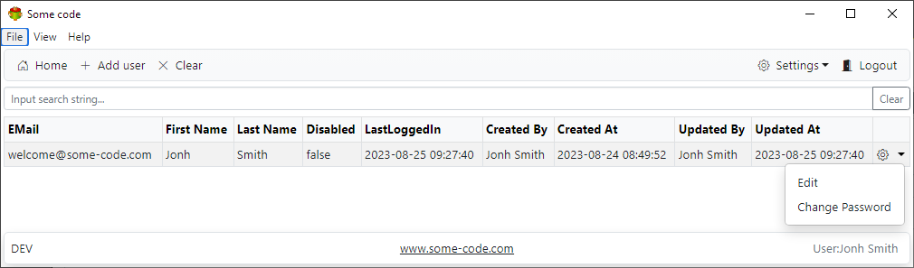
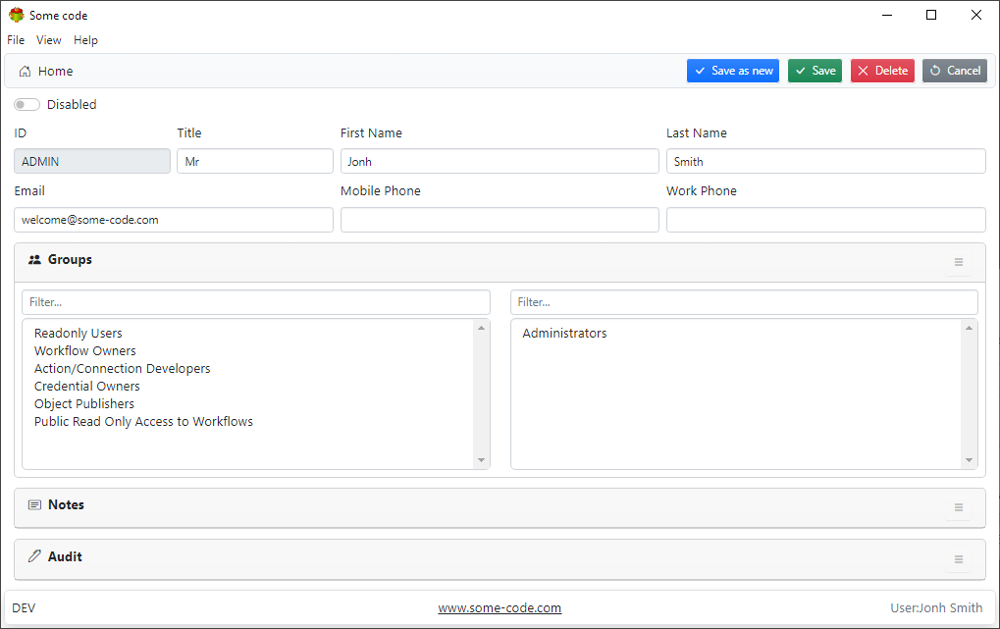
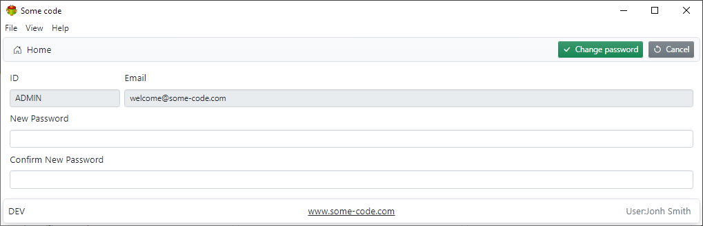
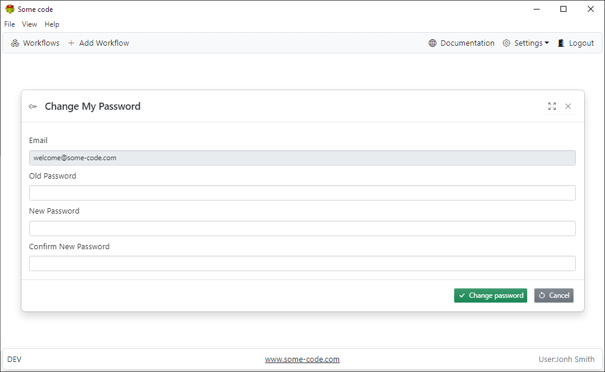
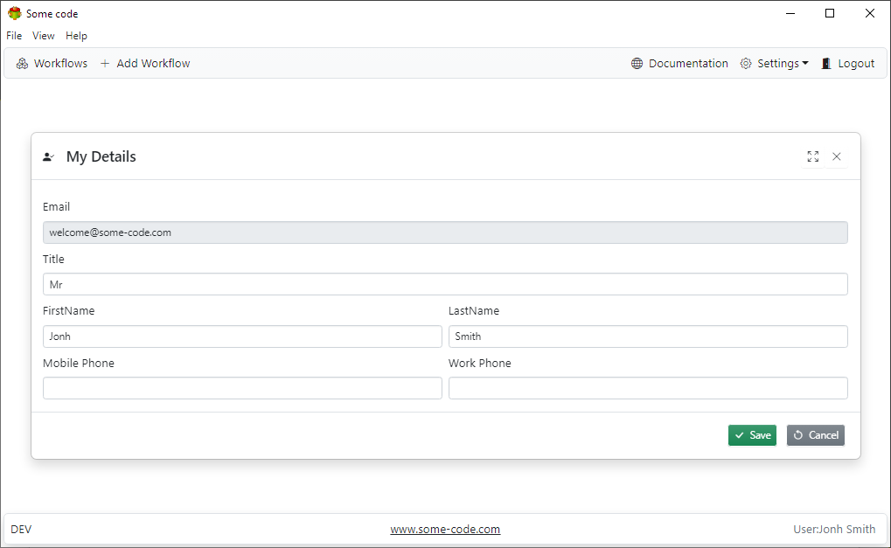

## Users list

## User form

## Changing User password

## Changing Current User password

## Changing Current User details

**Note**

It is possible to delete all users or disable them by accident. In this case, it might not be possible to login into Some code

Follow these steps to recover

- Set ENABLE_SECURITY=0
- Restart Some code
- Recreate/Enable users
- Set ENABLE_SECURITY=1
- Restart Some code
