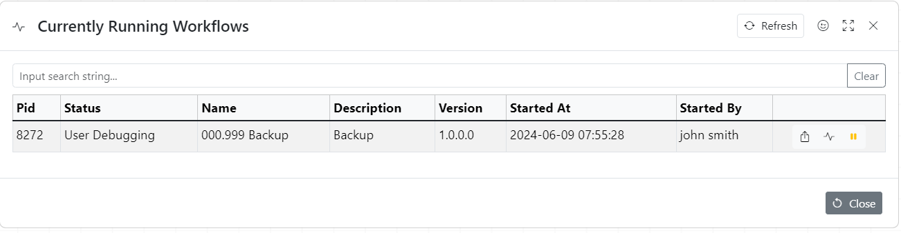

Workflow can be executed manually by clicking green arrow.

It is also possible to execute individual actions by using context menu.

## Workflow Automation.

There are three ways to automate workflow executions:

1. Using Integrated Scheduler
1. Constantly running workflow
1. Using hooks

Integrated scheduler can be used to execute workflow every five minutes but what about if it takes more than five minutes?\
This can be easily addressed by using constantly running packages

### Basic constantly running workflow

### Deploying workflow

Deploy workflow dialogue is used for constantly running workflows.

It allows to control level of logging

Once deployed the workflow execution can be stopped using the **"Currently Running Workflows"** dialogue

