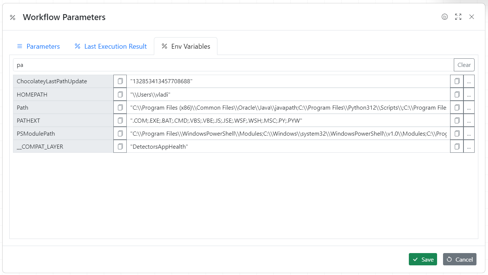

Every workflow may have parameters assigned to it. When workflow execution starts the parameters are calculated as the first step. If calculation fails execution is aborted.

**Parameters can be:**

1. Static
1. EV Variables
1. Calculated

_To access workflow parameters click the percentage % button at the top_


Here are two parameters one static and one calculated.


**Parameter script**


```javascript
const dayjs = require("dayjs");
return dayjs(Date.now()).format("YYYY-MM-DD hh:mm:ss");
```

Once workflow is executed once the actual parameters values can be seen by clicking "Last Execution result"


**Env Variables**



## Video Tutorial

<div class="aspect-w-16 aspect-h-9">
  <iframe src="https://www.youtube.com/embed/505OUcdbc2M" frameborder="0" allow="accelerometer; autoplay; clipboard-write; encrypted-media; gyroscope; picture-in-picture" allowfullscreen></iframe>
</div>
