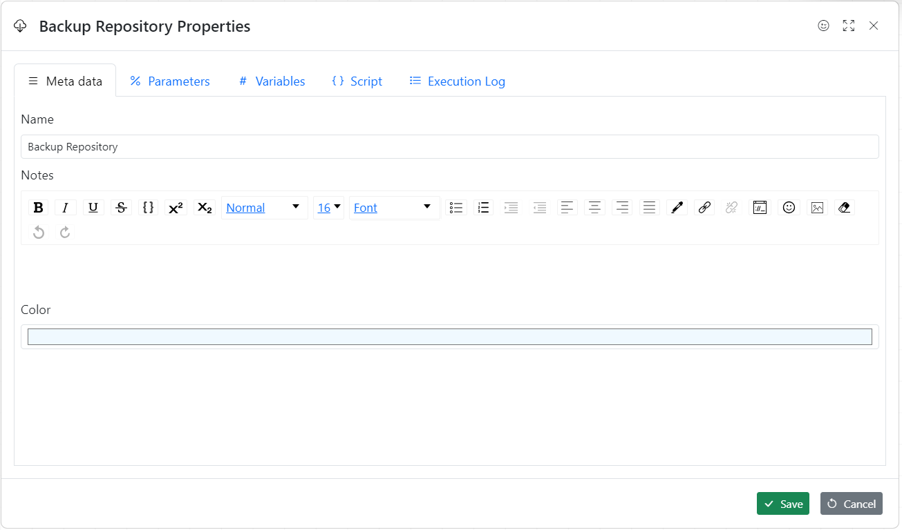
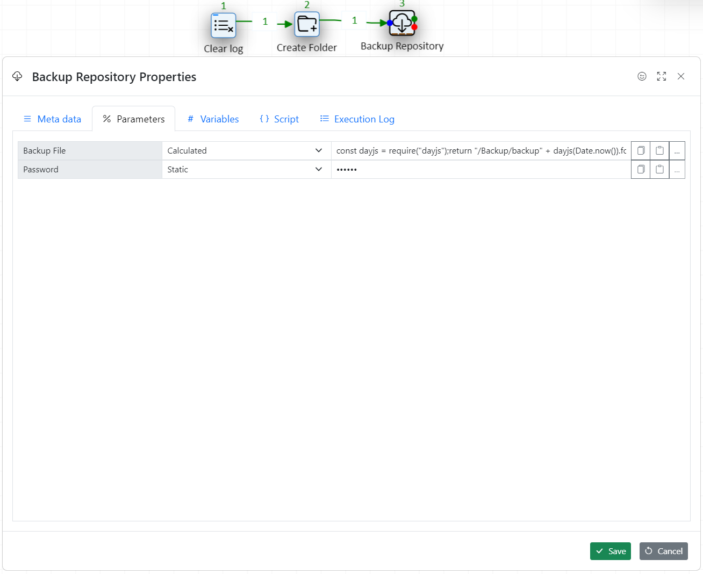
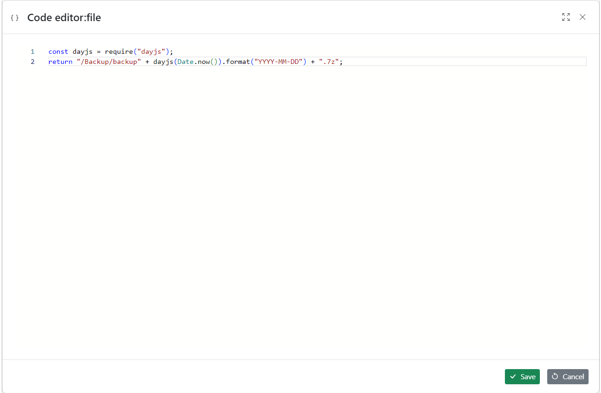
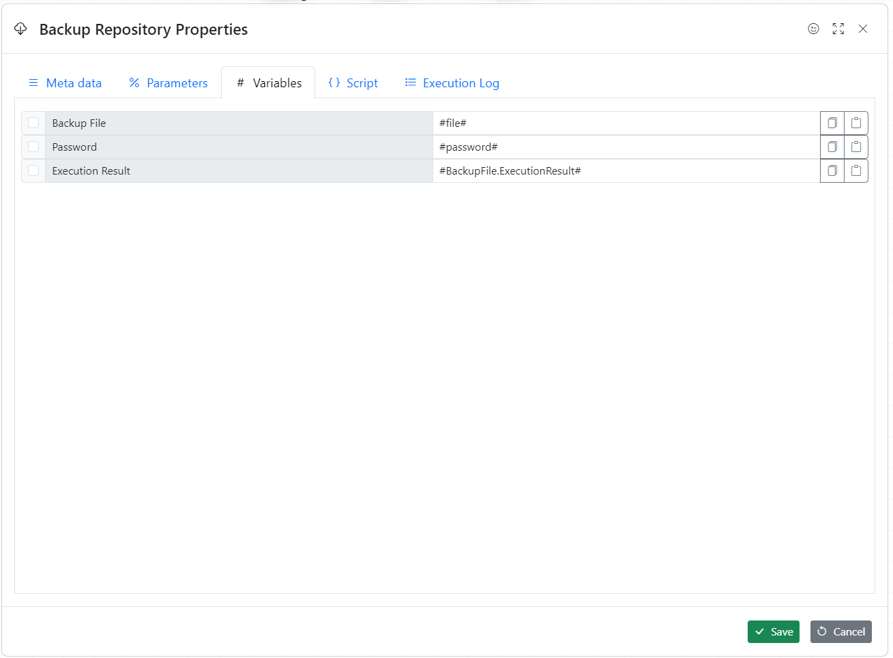
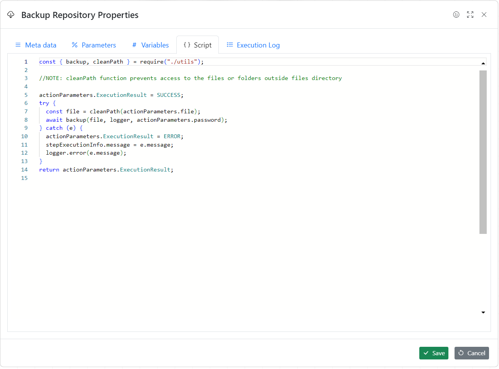

Actions are executable objects

1. To add the action to the workflow drag and drop it from the actions list
1. Click on action/object to select it
1. Double-click to change action properties
1. Or use right click to access action properties dialogue

## Action properties dialogue

### Metadata tab



### Parameters tab

Every action may have parameters assigned to it. When action execution starts the parameters are calculated as the first step. If calculation fails execution is aborted.

**Parameters can be**

1. Static
1. Variables
1. Calculated



**Calculated Parameter Example**



```javascript
const dayjs = require("dayjs");
return "/Backup/backup" + dayjs(Date.now()).format("YYYY-MM-DD") + ".7z";
```

### Variables tab



Once action is executed the selected variables are assigned and passed to the next action.

### Script tab

This tab provides a convenient way of checking action logic



### Debugging action execution

Input and output boxes provide a convenient way of debugging action execution


