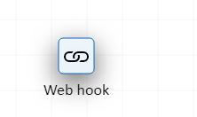
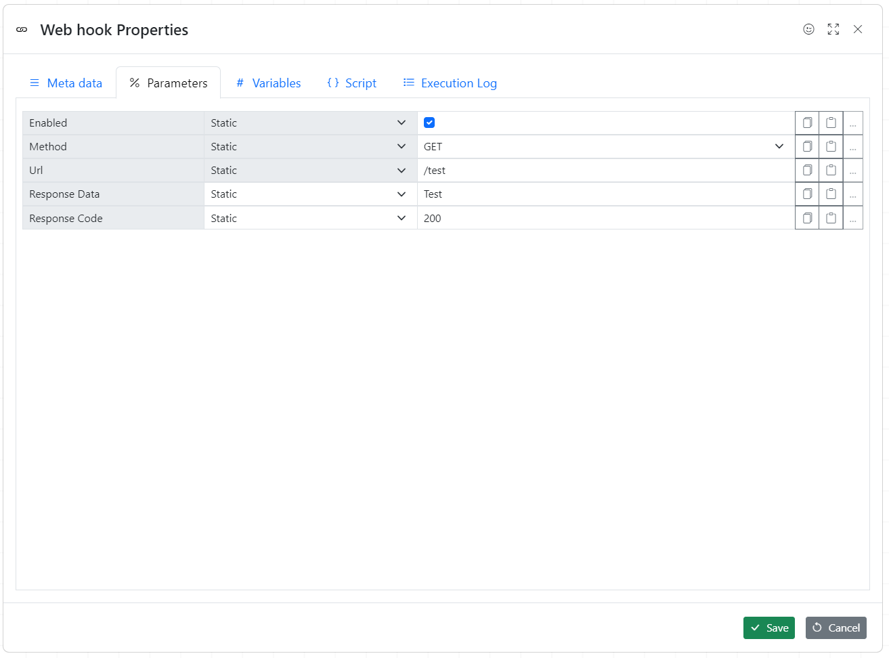

Hooks wait for certain events to happen for example Webhook waits for HTTP request

Hooks must be enabled first

## Web hook example

**Web hook url:**

http://servername:3333/api/webhooks/test

1. During debugging, hook is activated and once the event happened it is deactivated.
1. Once development is completed enable hooks execution in workflow metadata dialogue

> Hooks are embedded into **Some code**. Please contact us if you need a new hook type
