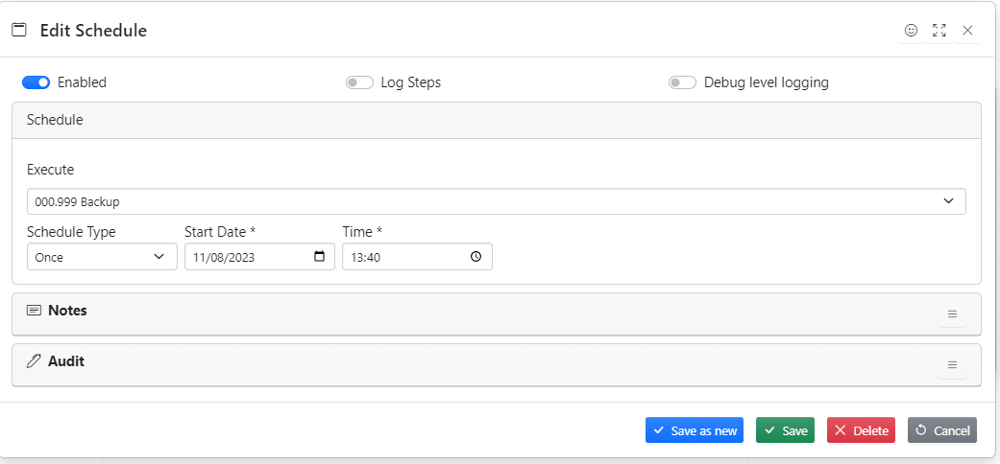
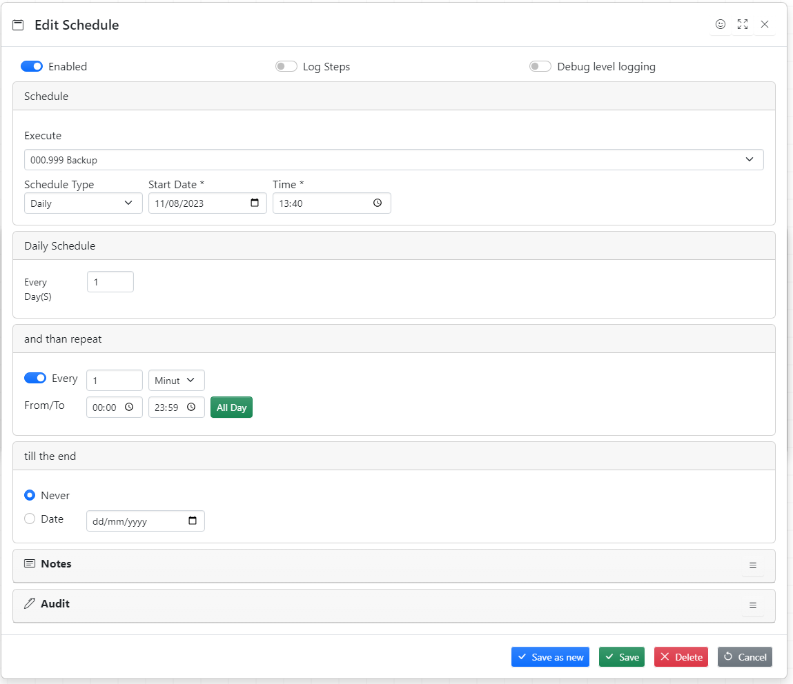
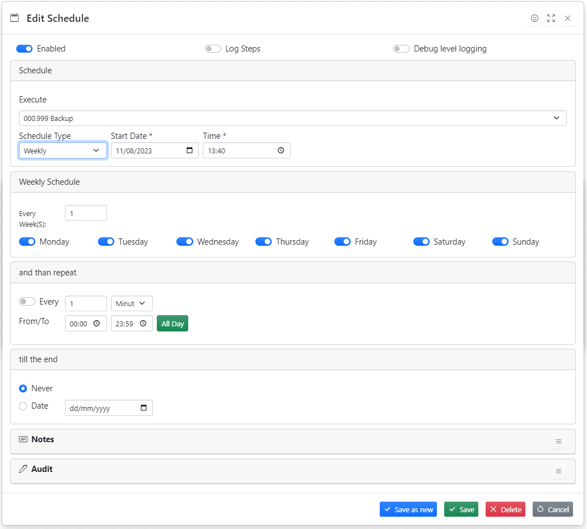
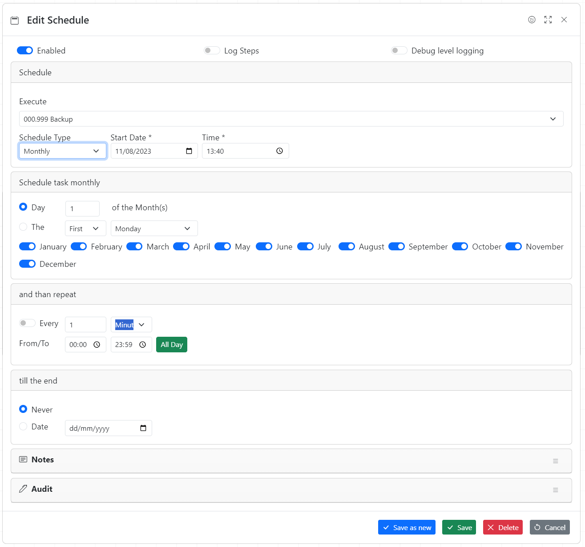

## List of scheduled packages

## Creating New Schedule

To create new schedule click **Add**, fill in all necessary fields and press **Save** button

## Schedule workflow once

## Schedule workflow daily

## Schedule workflow weekly

## Schedule workflow monthly

