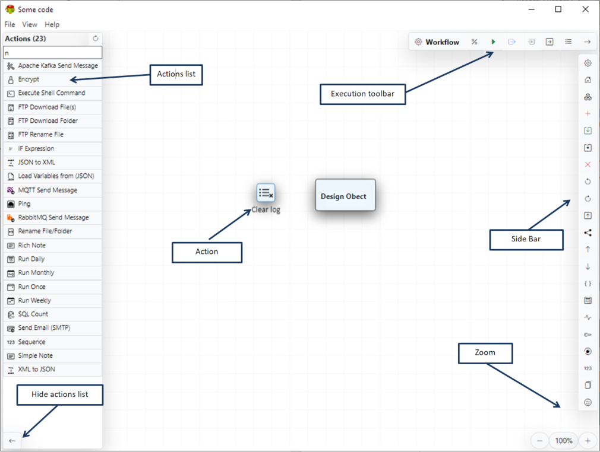
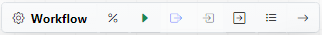
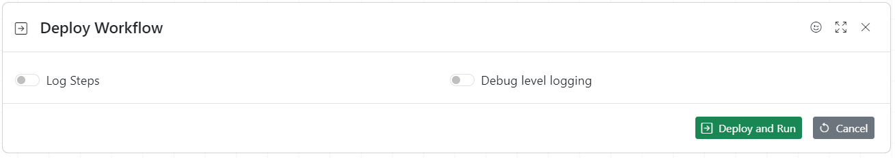
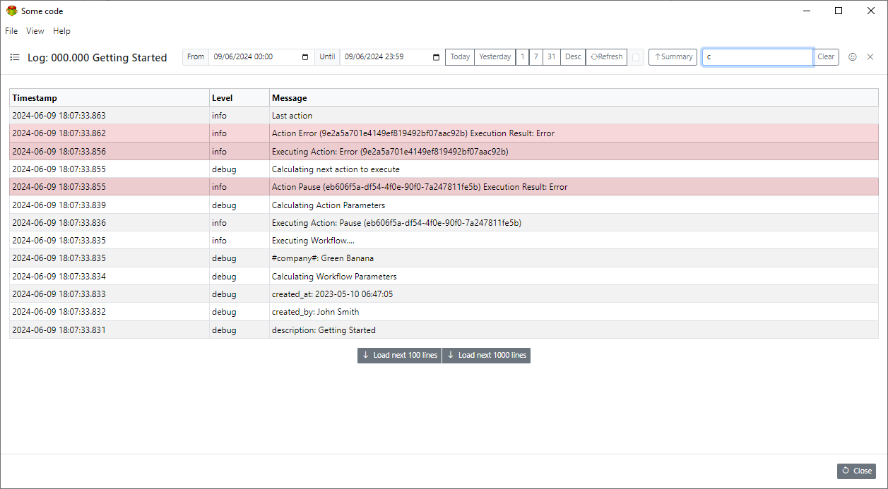
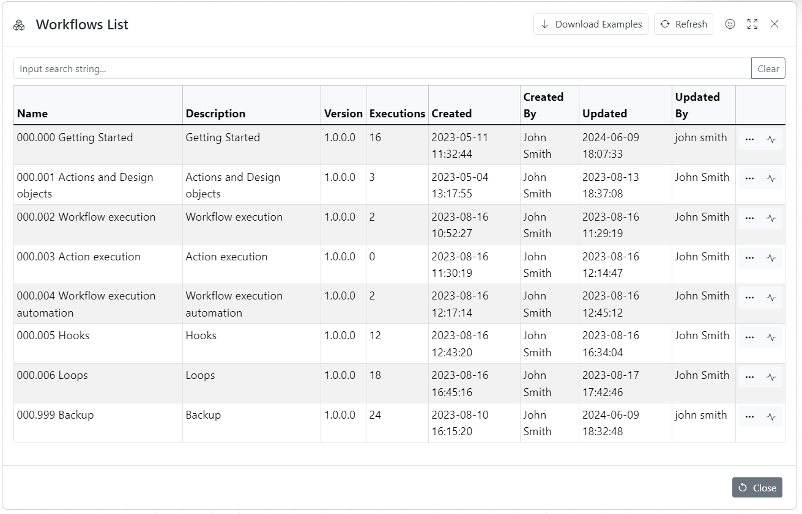
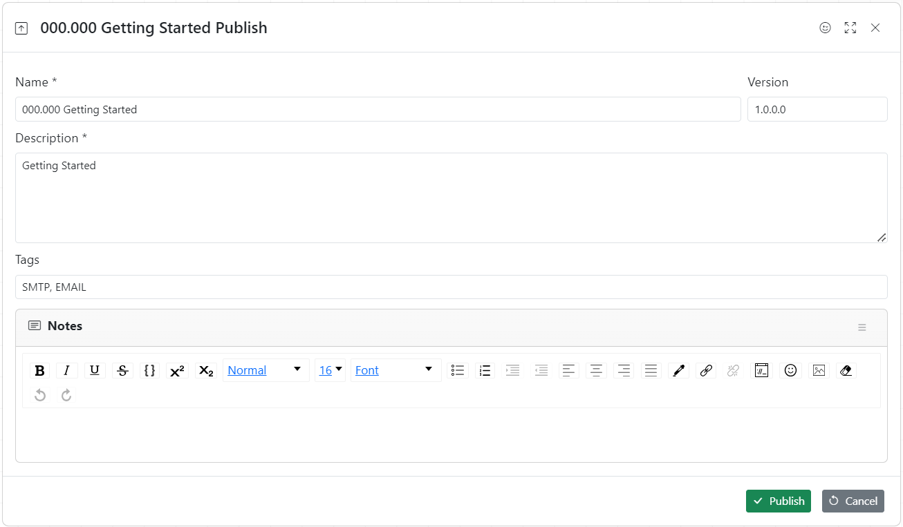
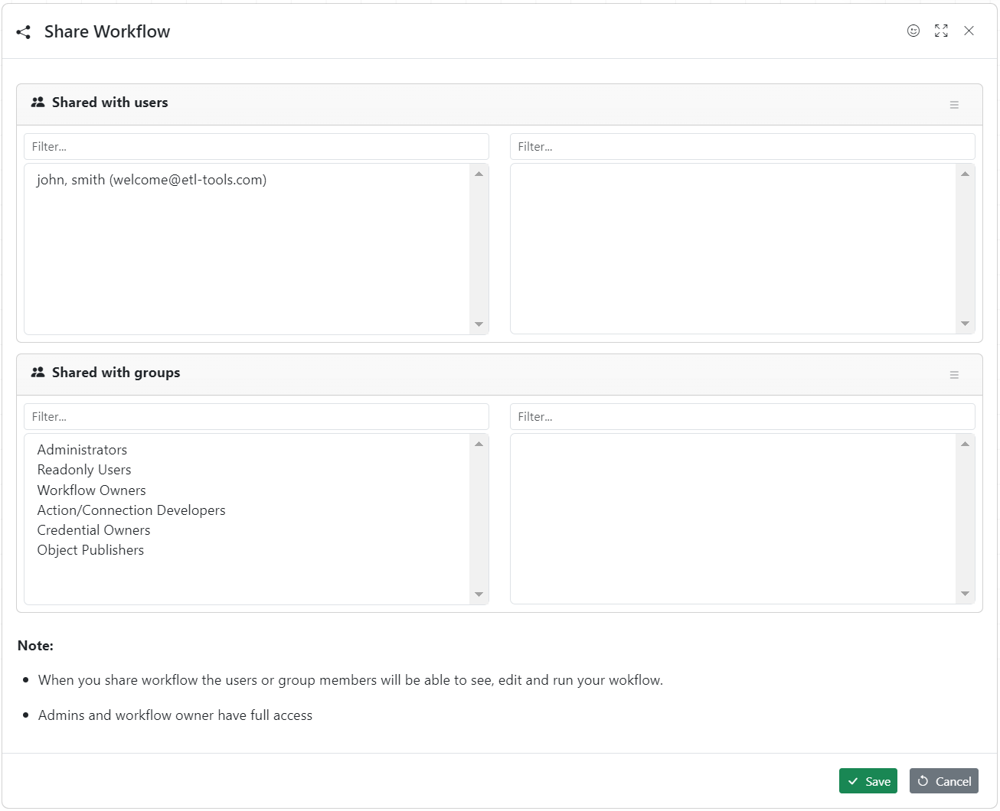
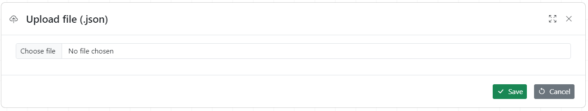
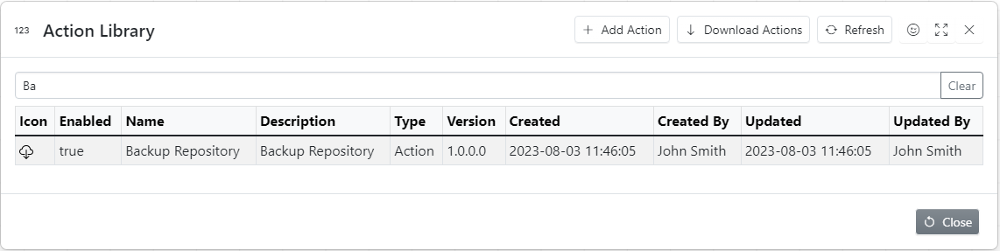

## Creating Workflow

To create new workflow click plus button, fill in all necessary fields and click ok button

## Workflow screen overview

The workflow consists of Actions and Design objects.

1. Actions are executable objects
2. Design objects are used for documenting workflows

## Working with actions

1. To add the action to the workflow drag and drop it from the actions list
1. Click on action/object to select it
1. Double-click to change action properties
1. Or use right click

Every workflow has a starting Action (green thin line on the top left)\
It might also have a default success Action (blue thin line on the top middle) and a default error Action (red thin line on the top right)\
The number on the top represents the execution order.
Thin brown lines at the bottom indicate the last action executed
Small circle at top right is brake point

### Joining the actions

1. Select the action
1. Click on the circle on the right and start dragging
1. Release mouse on the right of target action

_To remove the join repeat the process_

## Workflow Execution Toolbar

### Workflow Metadata Dialogue

### Workflow Parameters Dialogue

**Note** Workflow parameters are calculated as the first step of workflow execution

Every parameter has a name and a value
There are three types of parameters

1. Static
1. EV variable
1. Calculated

Once workflow is executed once the actual parameters values can be seen by clicking "Calculated parameters"

### Debugging workflow execution

Workflow can be executed manually by clicking green arrow. It is also possible to execute individual actions by using context menu.

### Deploy workflow

Deploy workflow dialogue is used for constantly running workflows.

It allows to control level of logging

### Execution log dialogue

Execution log helps to debug workflow execution and investigate problems

### Summary

### Details

## Sidebar Toolbar

Most of the toolbar actions are self explanatory so we will concentrate on not so obvious ones

1. Show/hide toolbar
1. Home
1. Open workflow
1. Add workflow
1. Save workflow
1. Save as workflow
1. Delete workflow
1. Undo
1. Redo
1. Publish workflow to the library
1. Share workflow with users or groups
1. Upload workflow from JSON file
1. Download workflow as JSON file
1. Edit workflow source
1. Scheduler
1. Currently running workflows
1. Credentials
1. Connections
1. Actions
1. File browser
1. Feedback dialogue

### Open workflow

### Publish workflow to the library

This dialogue publishes workflow to the public library so it can be used by all users of **Some code**

### Share workflow

This dialogue allows the user to share workflow with other users or group

### Upload workflow from JSON file

### Edit workflow source

### Scheduler

### Currently running workflows

### Credentials

### Connections

#### Difference between connection and credential

Connection defines list values the credential must have

For example

**Database connection**

1. host name
1. port
1. database name
1. user name
1. password

**Database credential**

1. host name = some-code
1. port = 1534
1. database name = sales
1. user name = john
1. password = fjwlfmw1

### Actions

### File browser

File browses provides a connivent way of browsing file system files

### Feedback dialogue

Sends feedback to "Some code" developers. We welcome your suggestions to make our software better

## Navigation

F2: Execute Workflow\
Crtrl+O: Open Workflow\
Crtrl+L: Execution Log\
Crtrl+P: Metadata\
Alt+P: Parameters\
Crtrl+S: Save package\
Crtrl+Z: Undo\
Crtrl+Y: Redo\
Crtrl+A: Select all\
Del: Delete selected\
\- Zoom In\
\+ Zoom Out\
 (Please click on the design area first)\

## Dialogue boxes

ESC Go back/Close dialogue\
Ctrl+S Save data\
